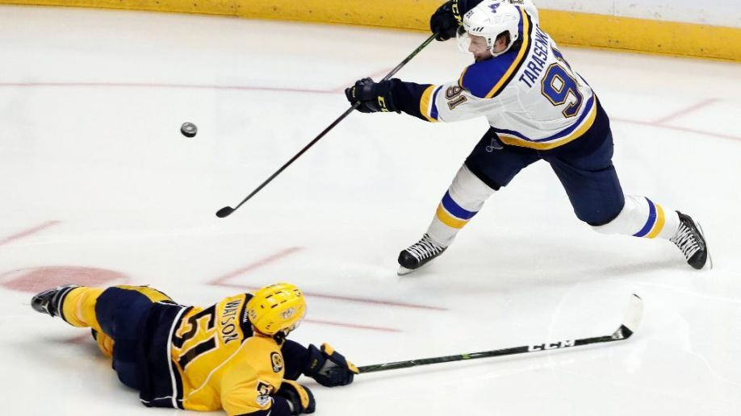

# NHL-Salaries-Multiple-Linear-Regression
This repository includes a multiple linear regression analysis of the salaries of NHL players. A complete preliminary analysis of the dataset was conducted and the details of this analysis are included in the [dataset section](https://github.com/atkinssamuel/NHL-Salaries-Multiple-Linear-Regression/tree/master/dataset). This section also includes a key for the meaning of each of the dataset features and a link to the source of the dataset.

## Features
The features that remained after removing duplicate columns and columns that did not have an apparent impact on each player's salary are as follows:

*NOTE: These are not the raw abbreviated versions of these features.*


```Salary, Born, City, Province/State, Country, Nationality, Height, Weight, Draft Year, Draft Round, Overall, Handedness, Last Name, First Name, Position, Team, Games Played, Goals, Assists, First Assists, Second Assists, Points, +/-, PIM, Shifts, TOI, TOI/GP, TOI%, Blocked Shots, Face-offs Won, Face-offs Lost, Face-off Percentage, Overtime Goals, Game-Winning Goals, Backhand Goals, Deflection Goals, Slap-Shot Goals, Snapshot Goals, Tip Goals, Wrap Around Goals, Crossbars Hit, Posts Hit, Shots Over the Net, Shots Wide of the Net, Backhand Shots, Deflected Shots, Slap-Shots, Snapshots, Tipped Shots, Wrap-Around Shots, Wrist-Shots```


Prior to hypothesizing which features may be linearly correlated with salary, we must first segregate players according to their position. This must be done because center-men, wingers, and defense-men are all compensated uniquely. 

After organizing the dataset according to each player's position, we must now remove the rookie players. This is a necessary step because rookies are required to adhere to entry-level contracts. These contracts pay significantly less than normal contracts and will undoubtedly skew the data. 

Now that the data has been parsed for potential skew factors, potential linear correlations will now be noted for each position. Note that there may be correlations between features that were not included and unexpected correlations between certain features and the salary. 

A player should hypothetically be paid according to the value that he brings to the team. The term value, in this context, should be defined as the number of wins a team achieves each year. To win games, teams must score more goals than their opponents. Therefore, a player's value can be measured by how successfully he generates goals for his team, and how successfully he prevents the enemy team from scoring. 

### Linear Correlation Hypotheses: Center-men
A center-man generates value for his team by primarily generating scoring opportunities for his team. He can generate these opportunities by winning face-offs, scoring goals, and assisting goals. A center-man's value also depends on his ability to shut down the enemy team. As such, we expect his value to also depend on his +/-, the number of shots he has blocked, and other defensive statistics. 
 
 

### Linear Correlation Hypotheses: Wingers
We expect a winger's salary to depend on the same elements that a center-man's salary depends on with one major exception: face-offs. Given that wingers rarely take face-offs, their value likely is not dependent on the number of face-offs that they win or lose. 


### Linear Correlation Hypotheses: Defensemen
Unlike the forwards, a defense-man's value depends much more on his defensive contributions. Although some of a defense-man's value may depend on his offensive contributions, the weighting of this value is undoubtedly different. As such, a separate analysis must be conducted for defense-man. 



----------------------

## Linear Correlation Testing
TBC