# NHL-Salaries-Multiple-Linear-Regression
This repository includes a multiple linear regression analysis of the salaries of NHL players. A complete preliminary analysis of the dataset was conducted and the details of this analysis are included in the [dataset section](https://github.com/atkinssamuel/NHL-Salaries-Multiple-Linear-Regression/tree/master/dataset). This section also includes a key for the meaning of each of the dataset features and a link to the source of the dataset.

## Features
The features that remained after removing duplicate columns and columns that did not have an apparent impact on each player's salary are as follows:

*NOTE: These are not the raw abbreviated versions of these features. Columns that had a tremendous amount of faulty or empty cells were also removed (DrftYr, DrftRd, Ovrl).*


```Salary, Born, City, Province/State, Country, Nationality, Height, Weight, Handedness, Last Name, First Name, Position, Team, Games Played, Goals, Assists, First Assists, Second Assists, Points, +/-, PIM, Shifts, TOI, TOI/GP, TOI%, Blocked Shots, Face-offs Won, Face-offs Lost, Face-off Percentage, Overtime Goals, Game-Winning Goals, Backhand Goals, Deflection Goals, Slap-Shot Goals, Snapshot Goals, Tip Goals, Wrap Around Goals, Crossbars Hit, Posts Hit, Shots Over the Net, Shots Wide of the Net, Backhand Shots, Deflected Shots, Slap-Shots, Snapshots, Tipped Shots, Wrap-Around Shots, Wrist-Shots```


Prior to hypothesizing which features may be linearly correlated with salary, we must first segregate players according to their position. This must be done because center-men, wingers, and defense-men are all compensated uniquely. 

After organizing the dataset according to each player's position, we must now remove the rookie players. This is a necessary step because rookies are required to adhere to entry-level contracts. These contracts pay significantly less than normal contracts and will undoubtedly skew the data. 

Now that the data has been parsed for potential skew factors, potential linear correlations will now be noted for each position. Note that there may be correlations between features that were not included and unexpected correlations between certain features and the salary. 

A player should hypothetically be paid according to the value that he brings to the team. The term value, in this context, should be defined as the number of wins a team achieves each year. To win games, teams must score more goals than their opponents. Therefore, a player's value can be measured by how successfully he generates goals for his team, and how successfully he prevents the enemy team from scoring. Center-men, wingers, and defense-men all provide value for their teams in unique ways. 

A center-man generates value for his team by primarily generating scoring opportunities for his team. He can generate these opportunities by winning face-offs, scoring goals, and assisting goals. A center-man's value also depends on his ability to shut down the enemy team. As such, we expect his value to also depend on his +/-, the number of shots he has blocked, and other defensive statistics. 
 
 

We expect a winger's salary to depend on the same elements that a center-man's salary depends on with one major exception: face-offs. Given that wingers rarely take face-offs, their value likely is not dependent on the number of face-offs that they win or lose. Furthermore, the number of goals that wingers score on average is different than the number of goals center-men score. This will impact the weight value attached to the number of goals a player scores. 


Unlike the forwards, a defense-man's value depends much more on his defensive contributions. Although some of a defense-man's value may depend on his offensive contributions, the weighting of this value is undoubtedly different. As such, a separate analysis must be conducted for defense-man. Note that the TOIX and TOI% features had to be ignored for defense-men because of the staggering amount of empty cells.


----------------------

## Checking for Linear Relationships
Center-men, wingers, and defensemen were all considered individually. Scatter plots between each potential independent variable and salary were created for each positional dataset. Clear linear relationships were noted. Furthermore, the r-value (Pearson product-moment correlation) and the p-value were also computed for each independent-dependent variable pair. 

The Pearson product-moment correlation is the ratio of the covariance of a set of data pairs and the product of the two standard deviations of those data pairs. The covariance of two random variables, x and y, is as follows:

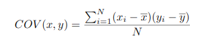

The covariance is a measure of the correlation between two variables. The standard deviation of a random variable x, is:

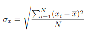

The standard deviation of a random variable, x, is a measure of how far away, on average, the data is situated from the mean. The product of the standard deviations of two random variables, x and y, is:

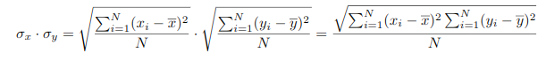

The ratio, then, of the covariance of a set of data pairs and the product of their standard deviations is:

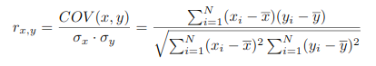

An r-value that approaches +1 indicates a strong positive correlation, an r-value that approaches -1 indicates a strong negative correlation, and an r value that does not approach -1 or +1 does not indicate a linear relationship between the data pairs. 
 
The p-value was also computed for each feature. The p-value is the probability that we would have observed the data given that the null hypothesis is true. In this context the null hypothesis is that the data is not linearly correlated. Therefore, the p-value in this context is the probability that we would have observed the data if the correlation coefficients were zero (the data is not linearly correlated). The p-value is determined by first finding the t-value: 

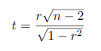

This value allows us to observe the 2-tailed p-value by consulting a t-distribution table. It is common to consider an observation statistically significant if it's p-value is less than 0.05. We will use this metric to determine which dependent variables are correlated with the output variable. We will use the r-value to compare the strength of relationships already deemed linear. 

After determining which variables correlate with the dependent variable, salary, multi-collinearity between the dependent variables must be checked. Multi-collinearity occurs when two independent variables are linearly correlated. When this occurs, the two variables are redundant and one of them should be excluded. We will use the same metric for determining multi-collinearity as we did to determine a linear relationship between the input variables and the output variable (p < 0.05). When choosing between which variable to exclude, we will choose the variable that has the lower r-value. After eliminating the redundant variables, we can then conduct our multi-linear regression analysis and begin to form models.

## MLR Analysis
Since we are assuming that the dependent variable is linearly correlated with the dependent variables, the equation that describes the relationship between the salary, y, and the data features, x<sub>1</sub> to x<sub>k</sub> is:

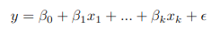

The epsilon in the above is the residual of the regression equation and the beta values

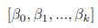

are the ideal weights. Since we do not know the ideal weights, we must formulate an estimate based on our observations (data). An individual observation, y<sub>i</sub>, can be written as follows:

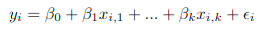

If we have a total of n observations we can express the n equations associated with the n observations in matrix form:

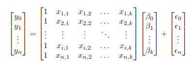

If we assign the following variables:

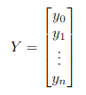
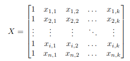
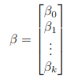
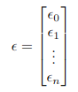

Our equation in matrix form becomes:

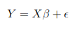

Rearranging for the residual (error):

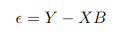

We wish to minimize the least squared error. To do this, we will first express the least squared error in simple terms:

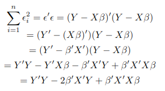

Then, we will take the derivative of the least squared error:

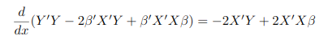

And finally, to minimize the least squared error, we will set the derivative to equal 0:

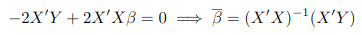

As shown above, we now have an estimate for the ideal weights in the context of multi-linear regression. We can use this estimate to create a model that accurately describes the relationship between the independent variables and the dependent output variable. 

## Results
### Centermen
The variables that correlated with the output variable, salary, according to the linearity metric defined above (p < 0.05) are:

```
Ht, Wt, GP, G, A, A1, A2, PTS, +/-, Shifts, TOI, TOIX, TOI/GP, TOI%, iBLK, iFOW, iFOL, FO%, OTG, GWG, G.Bkhd, G.Snap, G.Tip, G.Wrap, G.Wrist, Post, Over, Wide, S.Bkhd, S.Dflct, S.Slap, S.Tip, S.Wrap, S.Wrst
```

The [c_corr_values.csv](https://github.com/atkinssamuel/NHL-Salaries-Multiple-Linear-Regression/blob/master/results/centermen/c_corr_values.csv) file includes all of the p-values and r-values for each dependent-independent data pairing. 

The variables above were then testing for multi-collinearity. As mentioned previously, the metric used to determine linearity is a p-value < 0.05. A multi-collinearity matrix was generated and is illustrated in [c_dv_dv_matrix.csv](https://github.com/atkinssamuel/NHL-Salaries-Multiple-Linear-Regression/blob/master/results/centermen/c_dv_dv_matrix.csv). Since the most dominantly linear feature, assists, was linearly correlated with every single other feature, the only feature that will be used for this analysis is assists. 

Using the equation for the estimate of the weights that we derived above, we can generate a model for the independent variable, salary, using the dependent variable, assists. The weight values for this single-variable regression problem are ```[515342.73458342, 139618.94964624]```. Using these weights, we can generate a linear model to predict the salaries of the NHL center-men based on the number of assists they get. Since our model only uses one variable, we can visualize it easily in 2 dimensions. Our model, alongside the real data, is illustrated in the following image:

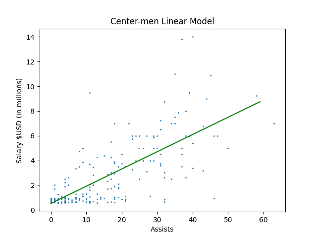

The green line in the image above attempts to capture a player's salary depending on how many assists he gets that year. For this analysis we could have used more variables and potentially achieved a more accurate model. However, this is a bad habit to fall into. Generally speaking, a simpler model is a more effective model. Any time two models have comparative accuracy, always choose the simpler one. 

### Wingers
Prior to illustrating the results for the wingers dataset, it is important to note that TOIX and TOI% were excluded from the analysis due to a staggering amount of empty cells. The [w-corr-values.csv](https://github.com/atkinssamuel/NHL-Salaries-Multiple-Linear-Regression/blob/master/results/wingers/w_corr_values.csv) file includes the p-values and r-values used for each data pairing. The same criteria used for center-men was applied to wingers. The variables that were linearly correlated with the output variable were:

```
Ht, Wt, GP, G, A, A1, A2, PTS, PIM, Shifts, TOI, TOI/GP, iBLK, iFOW', iFOL, FO%, OTG, GWG, G.Bkhd, G.Slap, G.Snap, G.Tip, G.Wrap, G.Wrst, Post, Over, Wide, S.Bkhd, S.Dflct, S.Slap, S.Snap, S.Tip, S.Wrap, S.Wrst
```

The most dominantly linear variable in the analysis for wingers was also assists. Using a [dependent variable-dependent variable p-value matrix](https://github.com/atkinssamuel/NHL-Salaries-Multiple-Linear-Regression/blob/master/results/wingers/w_dv_dv_matrix.csv), redundant variables were removed. All other variables except for face-offs won and face-offs lost were linearly correlated with assists. Therefore, the remaining dependent variables following redundancy elimination are assists and face-offs won.

The beta values produced using these variables are ```[330849.13104956, 86156.90770201, 3462.39882529]```. Given that there are now multiple variables that the output variable depends on, we require an extra dimension to visualize the linear relationship between the dependent variables and the independent output variable:

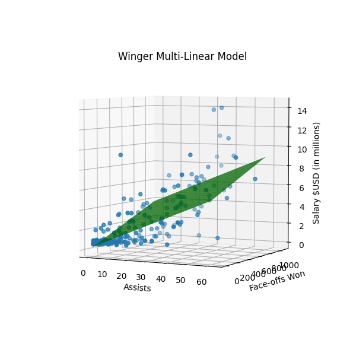

The image above illustrates that the salary of an NHL player depends on two variables: assists and face-offs won. The green surface is the model generated using the aforementioned techniques and the dots are the data used to create the model. 

### Defense-men
Just as with the wingers dataset, TOIX and TOI% were excluded due to their empty cells. The [d-corr-values.csv](https://github.com/atkinssamuel/NHL-Salaries-Multiple-Linear-Regression/blob/master/results/defensemen/d_corr_values.csv) file compiles all of the p-values and r-values for each data pairing. The variables that possessed a p-value less than 0.05 are as follows:

```
Wt, GP, G', A, A1, A2, PTS, PIM, Shift, TOI, TOI/GP, iBLK, OTG, GWG, G.Dflct, G.Slap, G.Snap, G.Tip, G.Wrst, Post, Over, Wide, S.Bkhd, S.Dflct, S.Slap, S.Snap, S.Tip, S.Wrst
```

Unlike the previous datasets, the strongest linear correlation for the defense-men dataset occurred between the TOI/GP feature and the output variable, salary. Using the another [dependent variable-dependent variable p-value matrix](https://github.com/atkinssamuel/NHL-Salaries-Multiple-Linear-Regression/blob/master/results/defensemen/d_dv_dv_matrix.csv), redundant variables were eliminated. As mentioned before, a p-value of less than 0.05 indicates a significant result. The only variables that remained after rectifying the redundancies were TOI/GP and Wt. 

The weights that minimize the least squares criteria are ```[-8512128.46386528, 529646.26848097, 18688.71378825]```. The image below delineates the model alongside the data used to create it:

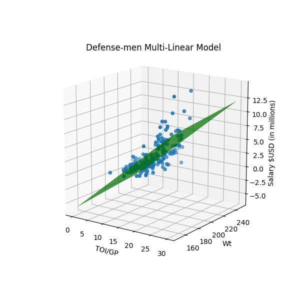

Out of the three models, this model seems to trace the output variable the closest. Intuitively, the factors that a defense-man's salary depend upon make sense. Heavier defense-men, generally speaking, will find more success in a contact sport like hockey. Furthermore, the more minutes a defense-man can soak up each night, the more he is going to be able to help his team defensively.

## Concluding Remarks
The analysis presented in this repository helped me gain a stronger understanding of statistics and model comparison. By putting my knowledge of statistics and mathematics to practice, I learned a lot about the tedious nature of linear analysis. Furthermore, I learned that a tremendous amount of care must go into data pre-processing and relationship analysis. Creating the model is a tiny fraction of the bigger picture. 
